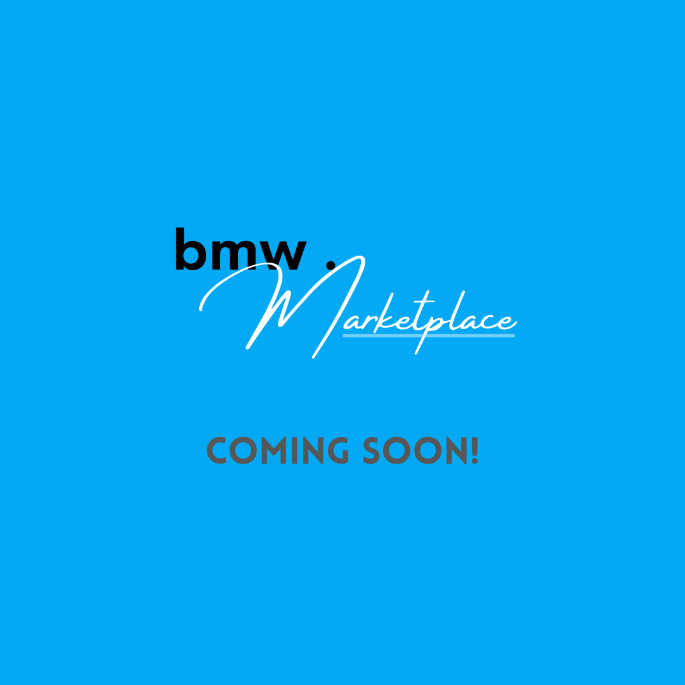

# BMW Marketplace 

BMW Marketplace is a social marketplace/public forum application designed to provide a unique and simple experience of buying, selling, and hosting giveaways for all BMW enthusiasts. Find anything from cars, parts, repair shops, and more.  

# Link to Backend Repo:
https://github.com/samara-amanda/bmw-marketplace-backend

# Table of Contents
- Overview

- Setup
How to run this app:
* npm install
* npm install react-router/react-router-dom
* npm start

- Future Updates

# License
"BMW Marketplace"
Copyright (c) 2021 Samara A Grant
Distributed under the MIT license. 

